# 🌳 **Finance Tree**

## Project Overview

**Finance Tree** is a system that allows users to create and manage **branches** based on a tree structure, recording and viewing **transactions** for each branch. Users can add, modify, or delete transactions, and upload related receipts for better transaction management.

### 🎯 Key Goals:

- Simplify the management of **complex organizational structures** or **personal financial tracking**.
- Easily handle **branch management** and **transaction recording** through an intuitive tree structure.

---

## ✨ Key Features

### 1. 🌿 **Tree-structured Branch Management**

- **Create/Delete Branches**: Users can add new branches or delete unnecessary branches within the tree structure.
- **Hierarchical Structure**: Manage branches with clear parent-child relationships for easy organization.

<p align="center">
  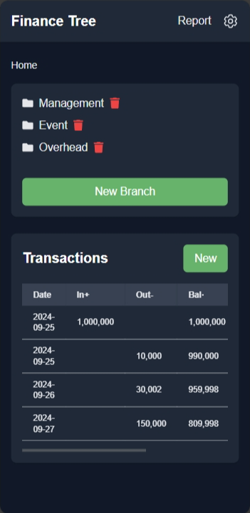
  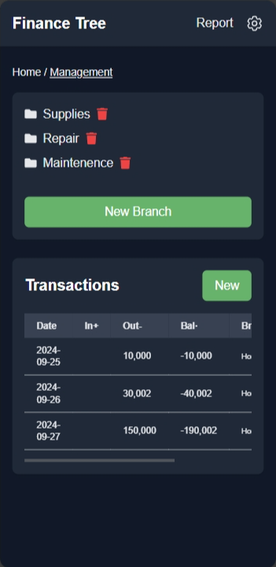
  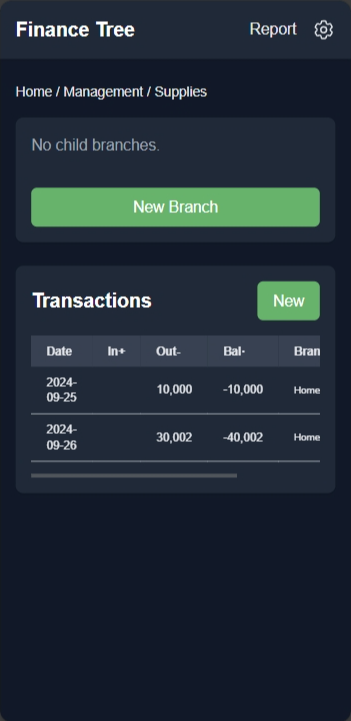
</p>

---
### 2. 💰 **Transaction Recording and Viewing**

- **Add Transactions**: Users can record transaction details for each branch, including descriptions and amounts (inflow/outflow).
- **Modify/Delete Transactions**: Easily update or remove existing transactions.
- **View Balance**: Check the total balance for each branch.

<p align="center">
  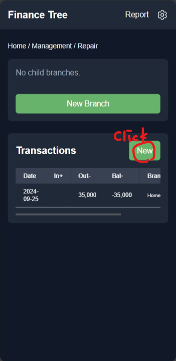
  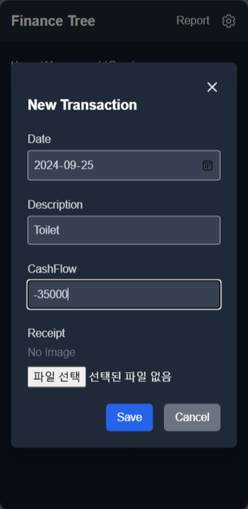
  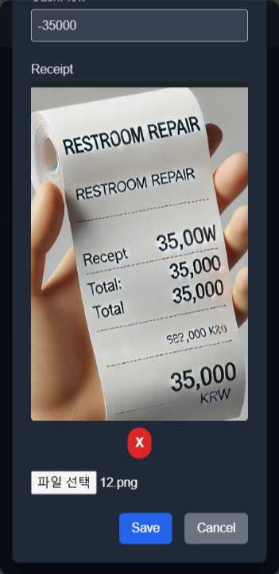
</p>

---

### 3. 🧾 **Receipt Image Management**

- **Upload Receipts**: Users can upload receipt images linked to transactions, helping with proof of transaction.
- **View Receipts**: View uploaded receipts by clicking on the linked transaction.

<p align="center">
  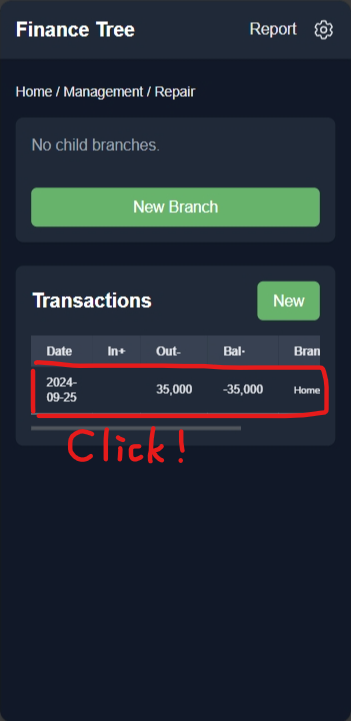
  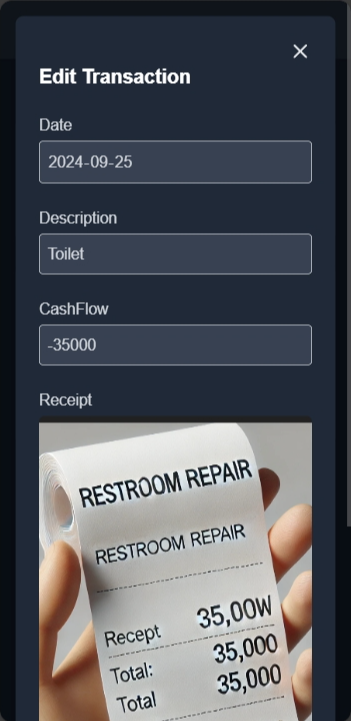
  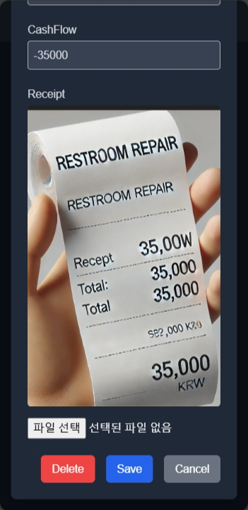
</p>

---

### 4. 🔐 **User Authentication and Management**

- **Sign Up/Login**: Users can create an account using an email and password, and log in securely.
- **Password Reset**: Users can reset their password via email if forgotten.

<p align="center">
  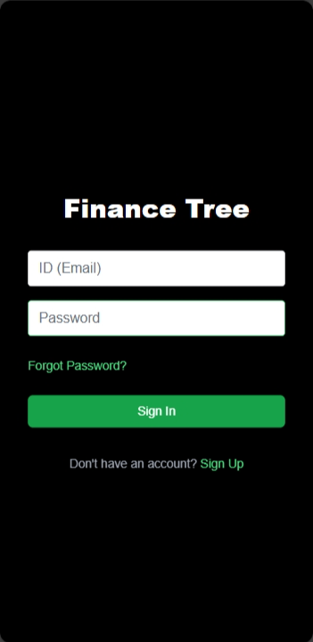
  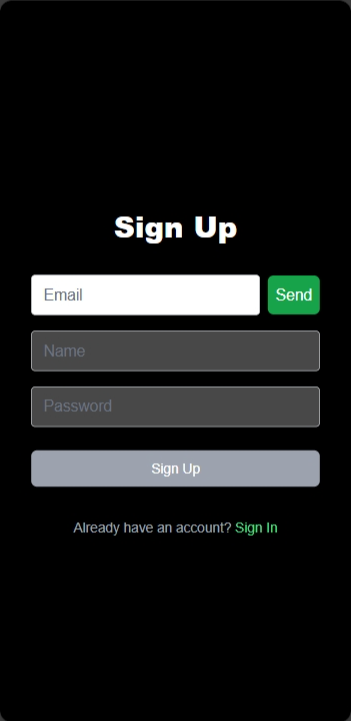
  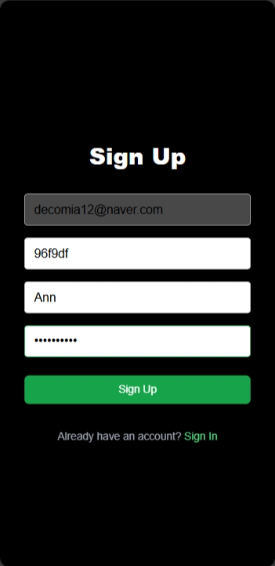
</p>

---

### 5. 📊 **Report Generation**

- **Generate Reports**: Users can generate financial reports based on transactions from specific branches or time periods.
- **Report Customization**: Customize the report by selecting branches or time ranges.
- **Download or View Reports**: Reports can be viewed directly or downloaded for external use (e.g., CSV or PDF).

<p align="center">
  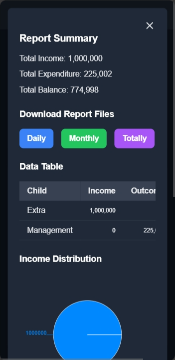
  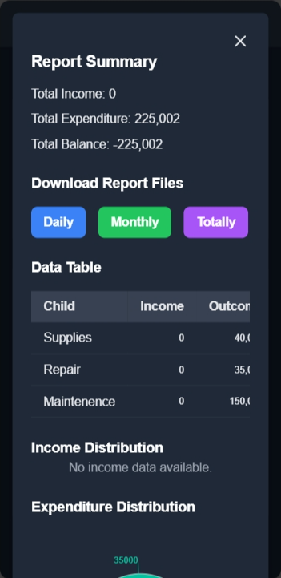
  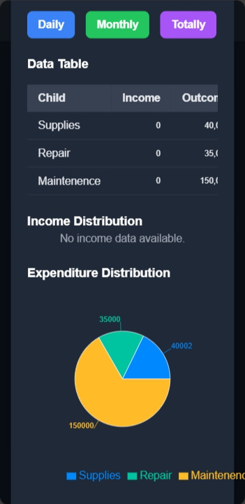
</p>

---

## 🛠️ Tech Stack

- **Frontend**: Next.js (React-based)
- **Backend**: REST API (FastAPI or similar)
- **Database**: PostgreSQL (or other relational databases)
- **Authentication**: JWT token-based authentication
- **File Upload**: FormData is used to handle receipt image uploads

---

## 🚀 Installation and Setup

### 1. Clone the repository and set it up

```bash
git clone <https://github.com/username/repository-name.git>
cd repository-name

```

### 2. Set environment variables

Create a `.env.local` file in the root directory and add the following environment variable:

```
NEXT_PUBLIC_BASIC_URL=https://your-backend-api-url.com

```

### 3. Install dependencies

```bash
npm install

```

### 4. Run the development server

```bash
npm run dev

```

The app will be running at [http://localhost:3000](http://localhost:3000/).

### 5. Run the backend server

Make sure you have a backend server implemented using FastAPI, Express, or another framework to handle API requests.

---

## 🎮 How to Use

### 1. **Sign Up**

- Create an account using your email and password.

### 2. **Login**

- After logging in, you can manage branches and transactions.

### 3. **Add Branch**

- Add or delete branches within the tree structure.

### 4. **Manage Transactions**

- Add transactions to a branch and upload related receipts for tracking.

### 5. **Reset Password**

- Use the password reset feature to receive a reset link via email.

---

## 📂 Project Structure

```
/src
├── /app
│   ├── /components         # Common components
│   ├── /libs               # API call-related modules
│   ├── /pages              # Page components
├── /public                 # Static files (images, etc.)
├── /styles                 # Global styles

```

---

## 🤝 Contributing

1. Fork this repository.
2. Create a new branch (`git checkout -b feature-branch-name`).
3. Commit your changes (`git commit -m 'Add some feature'`).
4. Push to the branch (`git push origin feature-branch-name`).
5. Open a pull request.